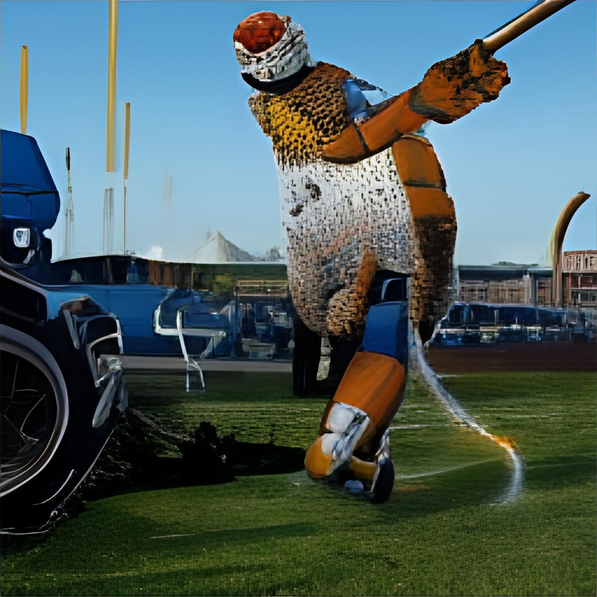

# image-generation

Playground for image generation

This repository contains the code and notes for various image generation algorithms that are out there.

## Installation notes

In order to use stylegan_encoder, we need the library `dlib`. This can only be installed when you have locally `cmake` installed. This can be done as follows:

```shell script
ruby -e "$(curl -fsSL https://raw.githubusercontent.com/Homebrew/install/master/install)" 2> /dev/null
brew install cmake
```

## DALL-E

[DALL-E](https://openai.com/blog/dall-e/) creates images from text captions for a wide range of concepts expressible in natural language. I didn't find a proper web interface or API to use it, and hence was not able to play around with it properly. 

The [Russian DALL-E](https://rudalle.ru/en/) can be used to generate images from the browser. I think the images from that website all look weird. The following examples are all generated on 26 January 2022.

| Avocado bridge | Avocado dashboard | Avocado sales | Avocado Twitter |
|---|---|---|---|
|  |  |  |  |
| Bigfoot playing football | Cartoon hedgehog | Michael Jackson playing tennis | Monster of Loch Ness drinking a cup of tea |
|  |  |  |  |

I also downloaded the DALL-E code from [Github](https://github.com/openai/dall-e), but that turned out not to be the generator itself. It somehow transforms images, like shown below, but I don't know exactly what it is doing. The transformation is executed in `dall_e_usage.py`.

| Original | Transformed |
|---|---|
|  |  |
   

## ArtFlow AI

[ArtFlow AI](https://artflow.ai/) allows users to generate portraits based on short, textual input. I have played around with the prompts. I logged into the website using my Google account. The style is nice, but it doesn't listen too well to the prompts. The following examples are all generated on 13 February 2022. 


## This person does not exist

[This person does not exist](https://thispersondoesnotexist.com/) is a simple website. Every time you visit it, you will see a realistic photo of a person that is completely generated. The authors explain on Youtube how it all works. He also open sources the code to generate your own images. This is definitely worthwhile diving deeper into!

- [Explanation part 1](https://www.youtube.com/watch?v=u8qPvzk0AfY)
- [Explanation part 2](https://www.youtube.com/watch?v=dCKbRCUyop8)
- [Explanation part 3](https://www.youtube.com/watch?v=SWoravHhsUU)

Similar websites are:
- [This artwork does not exist](https://thisartworkdoesnotexist.com/)
- [This cat does not exist](https://thiscatdoesnotexist.com/)
- [This chemical does not exist](https://thischemicaldoesnotexist.com/)
- [This horse does not exist](https://thishorsedoesnotexist.com/)
 